# Team Profile Generator

## And easy way to create a webpage containing information about your entire team!

### Step 1.
#### Open the 'index.js' file in the integrated terminal.
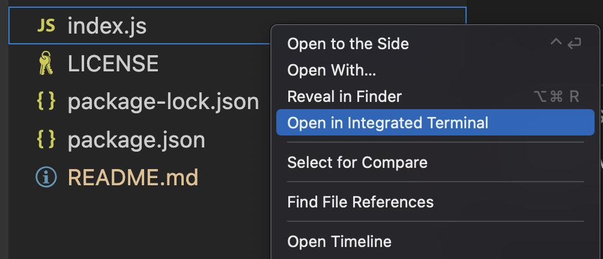
### Step 2.
#### To begin, type 'node index.js' and press return if you are on Mac, or enter if you are on a Windows.
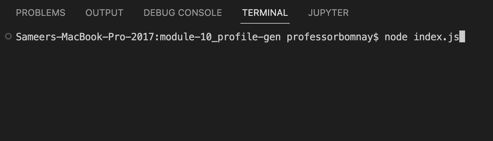
### Step 3.
#### Begin answering the questionnaire.
##### Enter the Manager's Name.
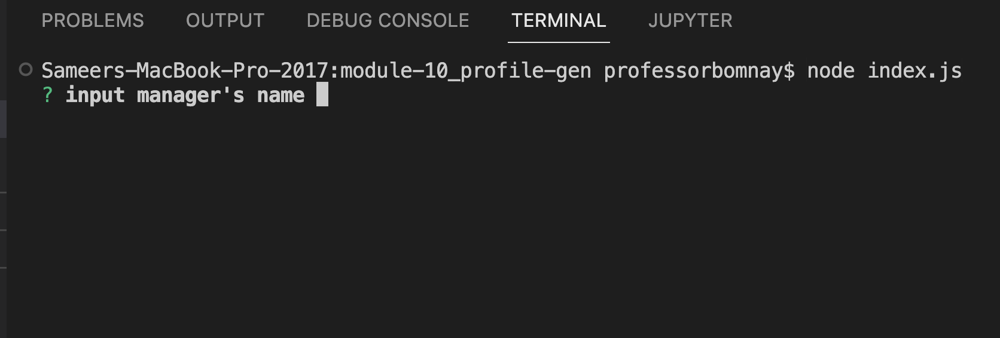
#### Enter the Manager's ID.
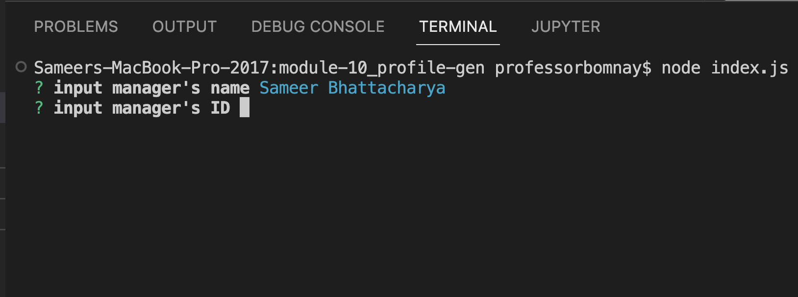
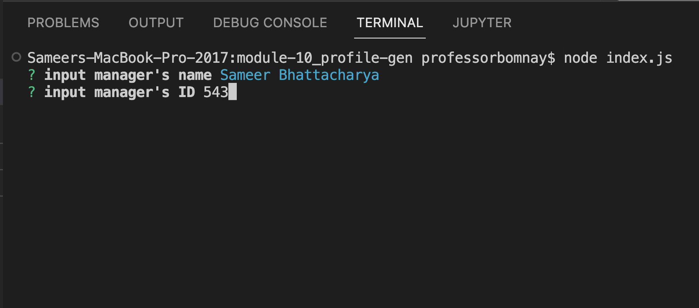
#### Enter Manager's Email.
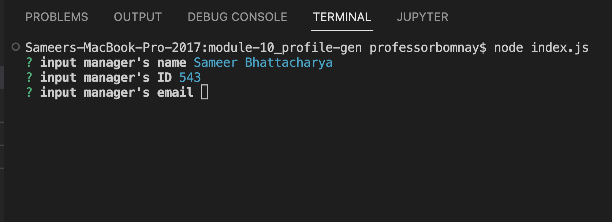
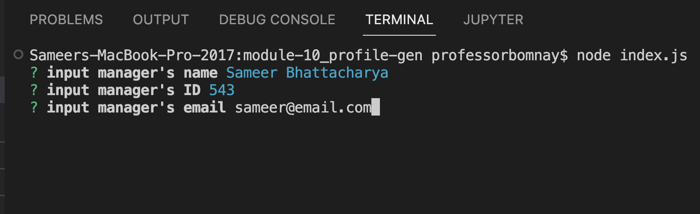
#### Enter Manager's Office Number
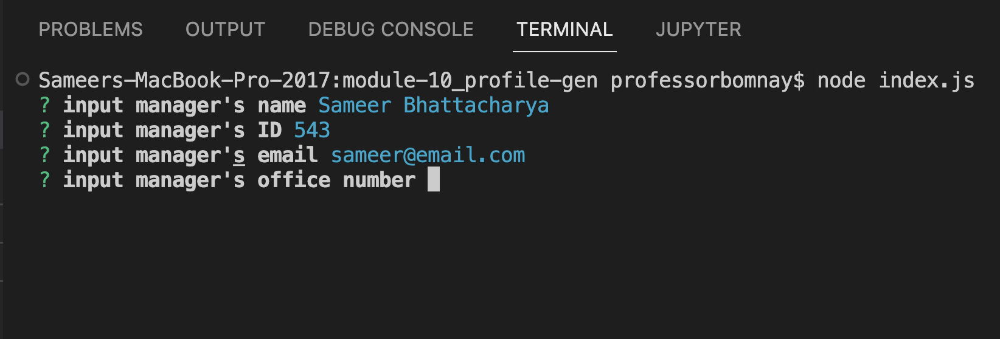
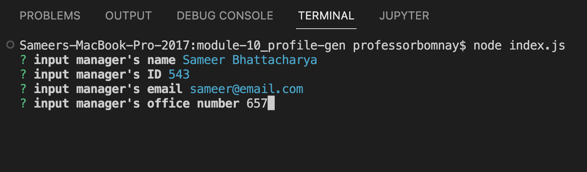
#### Congratulations! You've created your first profile!
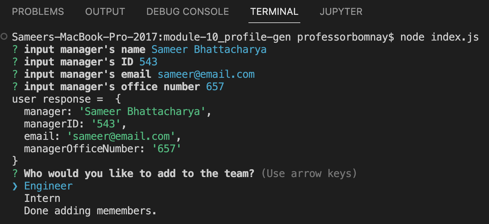
### Step 4.
#### If you require adding more members, using your arrow keys to navigate to the memeber you would like to add, and repeat the process of filling out the questionnaire.
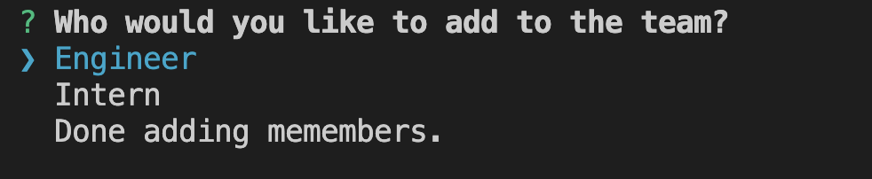
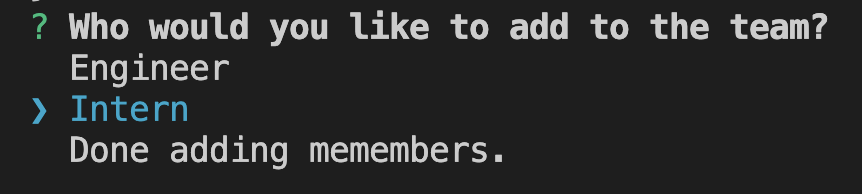
### Step 5.
#### Once you've added all of your members you can use your arrow keys to navigate to 'Done adding members.'
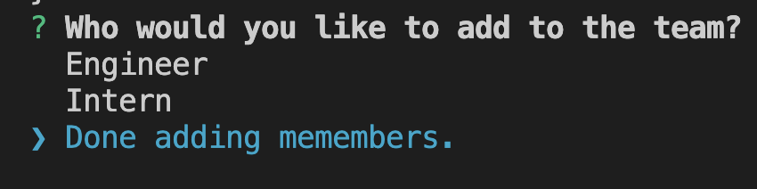
### Step 6.
#### Navigate to the 'dist' folder and open the newly generated 'team.html' file.
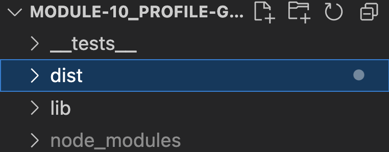
#### Right click 'team.html' and choose 'Open in Default Browser.'
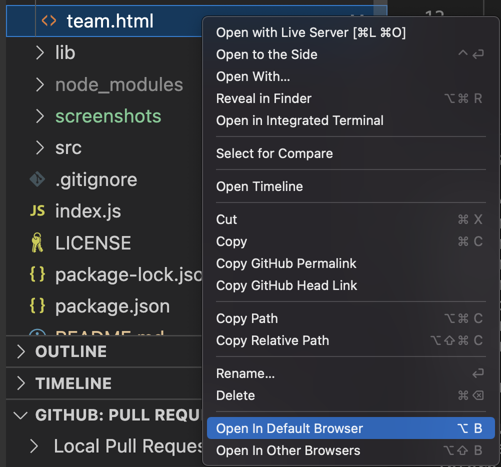
#### Congratulations! Enjoy your page of Team Members!
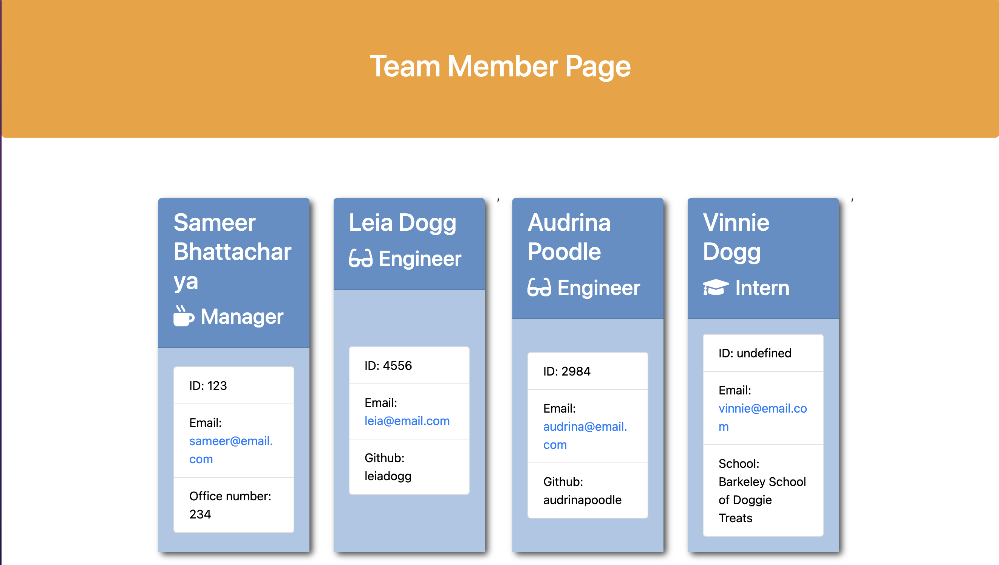